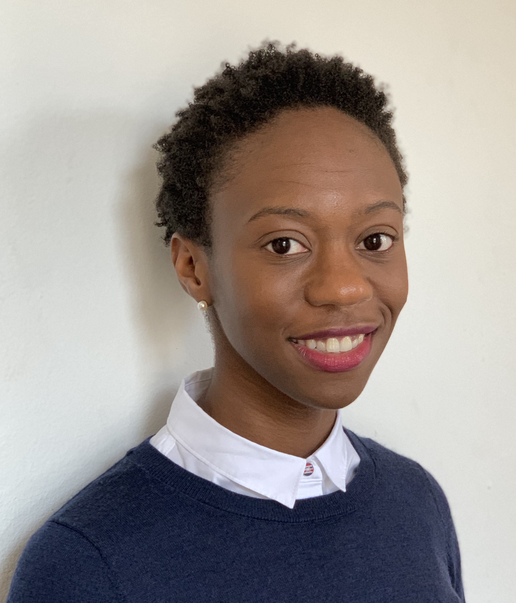

# About Me {-}

 
My name is Jillian Augustine and I am a data scientist the Advanced Analytics & AI Team at A1 Telekom Austria. I am a biochemist and molecular biologist by training who, after my PhD, jumped feet first into the world of Data Science in Telecommunications. I'm always looking for something new to learn (really, it's not just something I write on my CV). 

I chose the fields of biological research, and then data science because I love data to answer questions and gain new insights and learn more. To an extent, I think numbers are just numbers to be enhanced by domain knowledge and enjoy applying the skills I've a acquired in diverse range of projects. I am a keen public speaker and welcome opportunities to improve inclusion at public events. 
